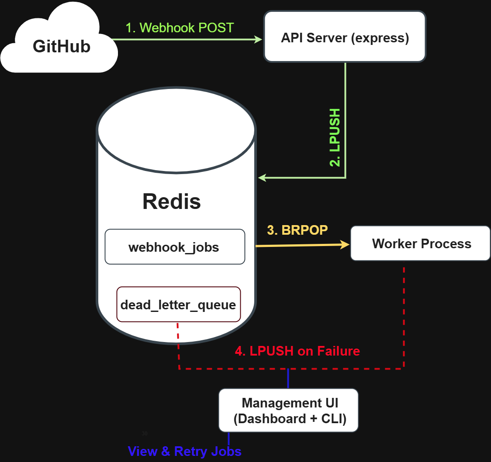
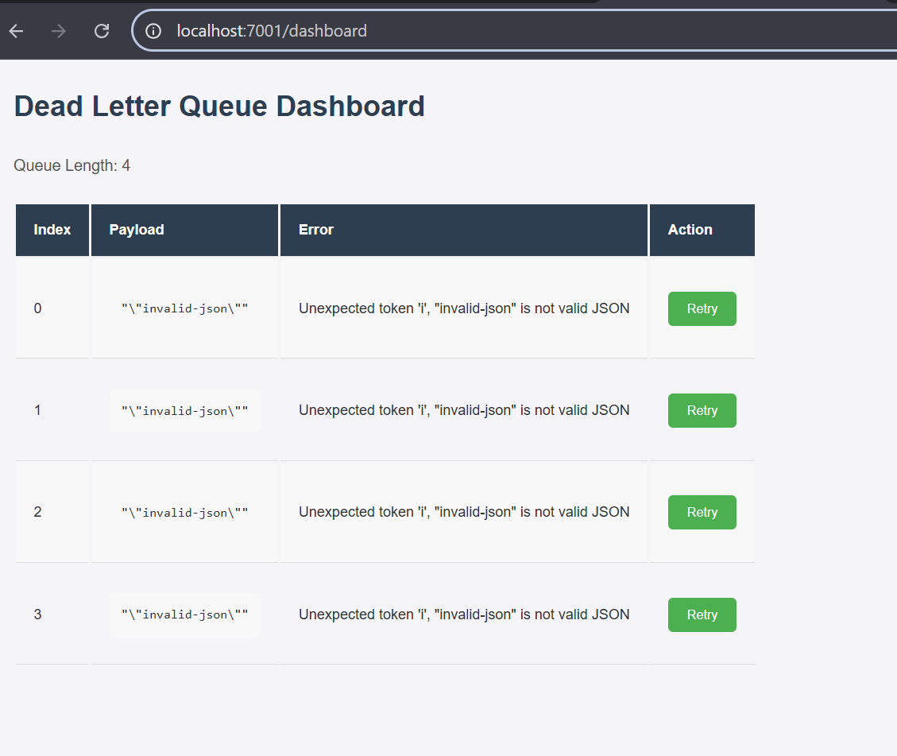

# Fault-Tolerant Webhook Processor

A resilient and observable webhook processing system built with Node.js, Express, and Redis. This project demonstrates a production-grade architecture for ingesting, queuing, and safely processing jobs from third-party services, ensuring no data is ever lost.

## 

## The Problem

Standard webhook endpoints are fragile. If your server is down for maintenance, experiences a temporary crash, or receives a malformed payload, incoming webhooks can be lost forever. This leads to lost data, failed payments, and a catastrophic loss of user trust. This project is engineered to solve that problem.

## The Solution

This system decouples the initial ingestion of a webhook from its final processing using a Redis-backed job queue. This architecture provides security, reliability, and observability.

- **Secure Ingestion API:** A lightweight Express server acts as the entry point. It instantly validates every webhook's cryptographic signature to prevent spoofing attacks, places the job onto a queue, and responds immediately. This makes it incredibly fast and secure.
- **Resilient Background Worker:** A separate Node.js process listens to the job queue. It processes one job at a time, ensuring that a single failure doesn't impact the entire system.
- **Dead-Letter Queue (DLQ):** If a job contains a permanent error (e.g., malformed data), it is automatically moved to a DLQ after failing. This isolates "poison pill" messages and prevents them from clogging the main queue.
- **Management & Recovery UI:** A simple web dashboard and an interactive CLI provide visibility into the DLQ, allowing an operator to inspect failed jobs and manually trigger a retry after a fix, demonstrating a full operational-support lifecycle.

---

## ✨ Key Features

- **Guaranteed Ingestion:** Never lose a webhook, even during server downtime.
- **Zero-Trust Security:** Validates webhook signatures using HMAC-SHA256 on the raw request body to prevent forgery and timing attacks.
- **High Resilience:** Uses a Dead-Letter Queue (DLQ) to isolate and handle failing jobs gracefully.
- **Asynchronous & Fast:** Decoupled architecture ensures the API is always responsive, no matter how long processing takes.
- **Atomic Operations:** Uses Redis transactions (`MULTI`/`EXEC`) to prevent race conditions when retrying jobs.
- **Full Observability:** Includes an interactive CLI and a web dashboard to view, manage, and retry failed jobs.

---

## 🛠️ Tech Stack

- **Backend:** Node.js, Express.js
- **Queuing / Caching:** Redis
- **Dashboard:** EJS (Embedded JavaScript Templates)
- **Tooling:** Winston (for logging), yargs (for CLI), `dotenv`, `cross-env`

---

## 🚀 Getting Started

Follow these instructions to get the project running on your local machine.

### Prerequisites

- Node.js (v18 or later recommended)
- An active Redis instance
- `ngrok` (for exposing your local server to GitHub for testing)

### Installation & Setup

1.  **Clone the repository:**

    ```bash
    git clone https://github.com/TheBigWealth89/webhook-test.git
    cd webhook-test
    ```

2.  **Install dependencies:**

    ```bash
    npm install
    ```

3.  **Set up environment variables:**

    - Create a `.env` file in the root of the project.
    - Add your GitHub webhook `WEBHOOK_SECRET`.

4.  **Run the application for development:**

    - Open three separate terminals.
    - Terminal 1 (API Server): `npm run dev`
    - Terminal 2 (Worker): `npm run dev:worker`
    - Terminal 3 (Dashboard): `npm run dev:dashboard`

5.  **Expose your local API server:**

    ```bash
    ngrok http 7000
    ```

    _(Use the port your API server is running on)_

6.  **Configure the GitHub Webhook:**
    - In your GitHub repo's Settings > Webhooks, create a new webhook.
    - Use the ngrok URL for the "Payload URL".
    - Set the Content Type to `application/json`.
    - Enter the same secret you used in your `.env` file.

---

## 🕹️ Usage

### Dashboard

Navigate to `http://localhost:7001/dashboard` (or your configured dashboard port) to view the failed jobs queue. From here, you can inspect payloads and retry jobs with a single click.



### Command-Line Interface (CLI)

The interactive CLI allows you to manage the DLQ from your terminal.

- **View all failed jobs:**
  ```bash
  node scripts/inspect-dead-queue.js --view
  ```
- **Retry a specific job by its index:**
  ```bash
  node scripts/inspect-dead-queue.js --retry 0
  ```
- **Flush (delete) all jobs from the queue:**
  ```bash
  node scripts/inspect-dead-queue.js --flush
  ```
