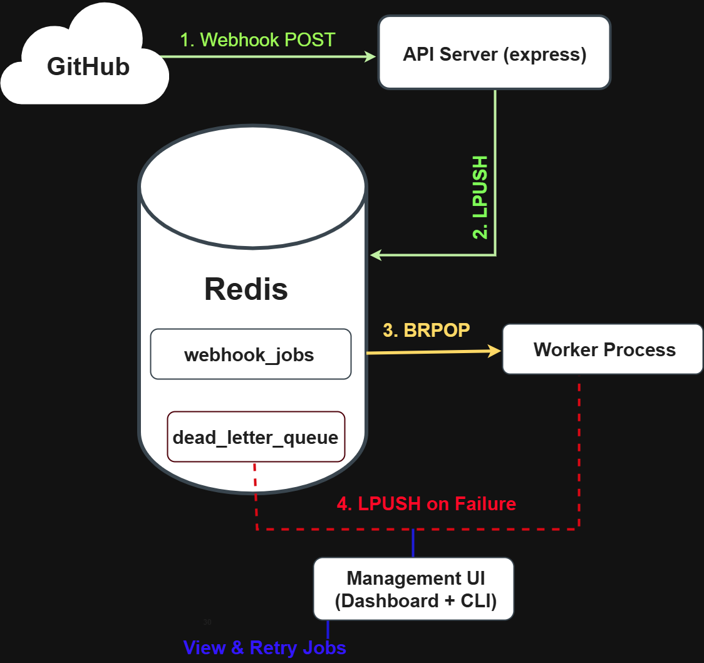
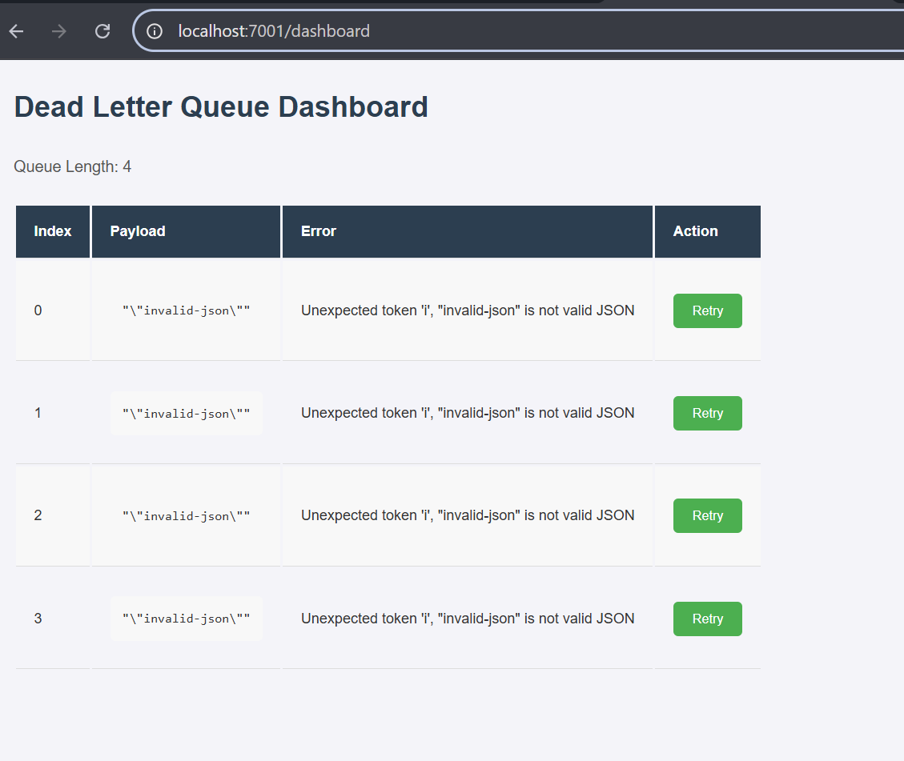

# Fault-Tolerant Webhook Processor

A resilient and observable webhook processing system built with Node.js, Express, and Redis. This project demonstrates a production-grade architecture for ingesting, queuing, and safely processing jobs from third-party services, ensuring no data is ever lost.

## 

## The Problem

Standard webhook endpoints are fragile. If your server is down for maintenance, experiences a temporary crash, or receives a malformed payload, incoming webhooks can be lost forever. This leads to lost data, failed payments, and a catastrophic loss of user trust. This project is engineered to solve that problem.

## The Solution

This system decouples the initial ingestion of a webhook from its final processing using a Redis-backed job queue. This architecture provides security, reliability, and observability.

- **Secure Ingestion API:** A lightweight Express server acts as the entry point. It instantly validates every webhook's cryptographic signature to prevent spoofing attacks, places the job onto a queue, and responds immediately. This makes it incredibly fast and secure.
- **Resilient Background Worker:** A separate Node.js process listens to the job queue. It processes one job at a time, ensuring that a single failure doesn't impact the entire system.
- **Dead-Letter Queue (DLQ):** If a job contains a permanent error (e.g., malformed data), it is automatically moved to a DLQ after failing. This isolates "poison pill" messages and prevents them from clogging the main queue.
- **Management & Recovery UI:** A simple web dashboard and an interactive CLI provide visibility into the DLQ, allowing an operator to inspect failed jobs and manually trigger a retry after a fix, demonstrating a full operational-support lifecycle.

---

## ✨ Key Features

- **Guaranteed Ingestion:** Never lose a webhook, even during server downtime.
- **Zero-Trust Security:** Validates webhook signatures using HMAC-SHA256 on the raw request body to prevent forgery and timing attacks.
- **High Resilience:** Uses a Dead-Letter Queue (DLQ) to isolate and handle failing jobs gracefully.
- **Asynchronous & Fast:** Decoupled architecture ensures the API is always responsive, no matter how long processing takes.
- **Atomic Operations:** Uses Redis transactions (`MULTI`/`EXEC`) to prevent race conditions when retrying jobs.
- **Full Observability:** Includes an interactive CLI and a web dashboard to view, manage, and retry failed jobs.

---

## 🔄 Retry Logic & Reliability

The system handles both transient and permanent failures using a multi-stage recovery strategy:

| Stage | Behaviour |
|---|---|
| **1st – 5th failure** | Job is re-queued with exponential backoff delay (`1s → 2s → 4s → 8s → 16s`) |
| **After 5 failures** | Job is moved permanently to the Dead-Letter Queue (DLQ) |
| **DLQ recovery** | Operator manually retries from Dashboard or CLI after fixing root cause |

- **Exponential Backoff formula:** `baseDelay (1s) × 2^retryCount`
- **Delayed queue:** Failed jobs are stored in a Redis sorted set (`delayed_webhook_jobs`) scored by their next execution timestamp. A background poller running every 1 second promotes them back to the main queue when ready.
- **Atomic moves:** All job transitions use Redis `MULTI`/`EXEC` transactions to prevent race conditions or double-processing.

---

## 🛠️ Tech Stack

| Layer | Technology |
|---|---|
| **Runtime** | Node.js 20 LTS |
| **API Framework** | Express.js v5 |
| **Queue / Cache** | Redis (ioredis v5) |
| **Dashboard** | EJS (Embedded JavaScript Templates) |
| **Logging** | Winston (file + console transports) |
| **CLI** | yargs |
| **Containerisation** | Docker, Docker Compose |
| **Testing** | Node.js built-in test runner |
| **Tooling** | `dotenv`, `cross-env` |

---

## 📁 Project Structure

```
webhook-test/
├── api/
│   ├── server.js           # Express API — ingests webhooks, validates HMAC signature
│   └── Dockerfile          # API service container
├── worker/
│   ├── index.js            # Background worker — consumes queue, handles retries
│   └── Dockerfile          # Worker service container
├── dashboard/
│   ├── dashboard.js        # Express dashboard — DLQ visibility & retry UI
│   ├── views/              # EJS templates
│   ├── public/             # Static CSS assets
│   └── Dockerfile          # Dashboard service container
├── db/
│   └── connections.js      # Redis client and connection management
├── utils/
│   ├── queueService.js     # Queue abstraction (push, pop, delayed, DLQ)
│   ├── retryLogic.js       # Exponential backoff and failure routing
│   └── logger.js           # Winston structured logger
├── scripts/
│   ├── push-bad-job.js     # Inject test jobs into the queue
│   └── inspect-dead-queue.js # CLI tool to manage the DLQ
├── tests/
│   ├── webhook.test.js     # API & signature validation tests
│   └── worker.test.js      # Worker reliability & retry logic tests
├── .env                    # Local environment variables (not committed)
├── .docker.env             # Docker-specific environment variables (not committed)
├── .env.example            # Template for environment setup
├── docker-compose.yml      # Orchestrates all services + Redis
└── package.json
```

---

## 🚀 Getting Started

Follow these instructions to get the project running on your local machine.

### Prerequisites

- Node.js (v18 or later recommended)
- Docker & Docker Compose (Recommended for easy setup)
- An active Redis instance (if running locally without Docker)
- `ngrok` (for exposing your local server to GitHub for testing)

### 🐳 Docker Setup (Recommended)

The easiest way to get started is using Docker and Docker Compose. This sets up all services (API, Worker, Dashboard) and a local Redis instance automatically.

1.  **Clone the repository:**
    ```bash
    git clone https://github.com/TheBigWealth89/webhook-test.git
    cd webhook-test
    ```

2.  **Start the system:**
    ```bash
    docker-compose up --build
    ```

3.  **Access the services:**
    - **API Server:** [http://localhost:8000](http://localhost:8000)
    - **Dashboard UI:** [http://localhost:8001/dashboard](http://localhost:8001/dashboard)
    - **Redis:** `localhost:6379`

> [!NOTE]
> The Docker environment uses its own `.docker.env` file. To run local scripts (like `push-bad-job.js`) against the Docker Redis, use:
> `$env:REDIS_URL="redis://localhost:6379"; node scripts/push-bad-job.js`

---

### 💻 Manual Local Setup

If you prefer to run the services individually without Docker:

1.  **Clone the repository:**
    ```bash
    git clone https://github.com/TheBigWealth89/webhook-test.git
    cd webhook-test
    ```

2.  **Install dependencies:**
    ```bash
    npm install
    ```

3.  **Set up environment variables:**
    - Create a `.env` file in the root of the project.
    - Use `.env.example` as a template.
    - Add your `WEBHOOK_SECRET` and `REDIS_URL`.

4.  **Run the application:**
    - Open three separate terminals:
    - Terminal 1 (API): `npm run dev` (Port 7000)
    - Terminal 2 (Worker): `npm run dev:worker`
    - Terminal 3 (Dashboard): `npm run dev:dashboard` (Port 7001)

5.  **Expose your local API server:**
    ```bash
    ngrok http 7000  # Or 8000 if using Docker
    ```

6.  **Configure the GitHub Webhook:**
    - In GitHub repo Settings > Webhooks, use the ngrok URL for the "Payload URL".
    - Set Content Type to `application/json`.
    - Enter the same secret used in your `.env` or `.docker.env`.

---

## 🕹️ Usage

### Dashboard

Navigate to `http://localhost:7001/dashboard` (or your configured dashboard port) to view the failed jobs queue. From here, you can inspect payloads and retry jobs with a single click.



### Command-Line Interface (CLI)

The interactive CLI allows you to manage the DLQ from your terminal.

- **View all failed jobs:**
  ```bash
  node scripts/inspect-dead-queue.js --view
  ```
- **Retry a specific job by its index:**
  ```bash
  node scripts/inspect-dead-queue.js --retry 0
  ```
- **Flush (delete) all jobs from the queue:**
  ```bash
  node scripts/inspect-dead-queue.js --flush
  ```

### Testing Bad Jobs

Inject test jobs into the queue to verify the worker's error handling and retry behaviour:

- **Push an invalid JSON string** (causes `JSON.parse` to throw in the worker):
  ```bash
  node scripts/push-bad-job.js invalid-json
  ```
- **Push a structurally bad payload** (parses fine, but fails worker validation):
  ```bash
  node scripts/push-bad-job.js bad-payload
  ```

> When running against the Docker stack, prefix with the Redis URL:
> ```powershell
> $env:REDIS_URL="redis://localhost:6379"; node scripts/push-bad-job.js bad-payload
> ```

---

## 🧪 Testing

The project includes comprehensive tests using Node's built-in test runner.

**Run tests once:**
```bash
npm test
```

**Run tests in watch mode:**
```bash
npm run test:watch
```

| Test File | Coverage |
|---|---|
| `tests/webhook.test.js` | Signature validation, queuing, API responses |
| `tests/worker.test.js` | Job processing, retry logic, DLQ routing |

---

## 📋 Logging

All services use structured JSON logging via **Winston**.

| Log File | Contents |
|---|---|
| `logs/combined.log` | All log levels (info, warn, error, debug) |
| `logs/error.log` | Error-level logs only |
| Console | Dev mode only (`NODE_ENV !== production`) |

Log entries include a `timestamp`, `level`, and `message` field for easy parsing.

---

## 🤝 Contributing

1. Fork the repository.
2. Create a feature branch: `git checkout -b feature/my-feature`
3. Commit your changes: `git commit -m 'feat: add my feature'`
4. Push to the branch: `git push origin feature/my-feature`
5. Open a Pull Request.
